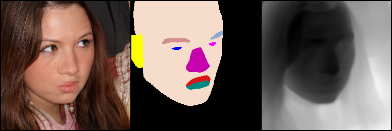

# SynthForge: Synthesizing High-Quality Face Dataset with Controllable 3D Generative Models

## Prerequisites
In order to use the dataset, the following packages need to be installed in the python environment
```
scikit-image
colour
kornia
```

If you wish to train the models, you would further need to install the following libraries as well!
```
pytorch-lightning
```


## Data 
### Schema
The dataset is organised in the following way:
```bash

<root>/
    |- images/
    |    |- 00000.png
    |    |- 00001.png
    |    :
    |    |- 99999.png
    :
    |- annotations/
    |    |- 00000.json
    |    |- 00001.json
    |    :
    |    |- 99999.json
    :
    |- seg/
    |    |- 00000.png
    |    |- 00001.png
    |    :
    |    |- 99999.png
    :
    |- depth/
    |    |- 00000.png
    |    |- 00001.png
    |    :
    |    |- 99999.png
    :
    :
    |
```


### Loading

```python
from synthforge_train.src.data.synthforge import SynthForgeDataset
from synthforge_train.src.data.utils import seg_classes_to_colors

ds = SynthForgeDataset(
    dataset_path='...',
    is_train=False,
    disable_crop_op=True
)

sample = ds[np.random.randint(len(ds))]

## images returned are in range [-1, 1]
img = sample['img'] * 0.5 + 0.5

## seg_label key contains the segmentation map: shape - [H, W]
seg_map = sample["seg_label"]

## depth contains the normalized depth in range [0, 1]
depth = sample['depth']
```


## Visualization
```python
depth_3ch = depth.repeat(3, 1, 1)
seg_map_rgb = seg_classes_to_colors(seg_map.unsqueeze(0), plot_colors_next3d)


grid = make_grid(torch.stack([img, seg_map_rgb, depth_3ch]))
T.ToPILImage()(grid)
```


    
## Training

The multimodal backbone can be trained issuing the following command:

```bash
foo@bar:~/synthforge-train$ CUDA_VISIBLE_DEVICES=0,1,2,3 python -m synthforge_train.trainers.next3d_next3d_multimodal fit \
    --config synthforge_train/configs/base_config.yaml \
    --trainer.default_root_dir ... \
    --trainer.max_epochs 20 \
    --trainer.deterministic False  \
    --data.next3d_train_dataset_path ... \
    --data.next3d_val_dataset_path ... \
    --data.batch_size 16 \
    --data.val_batch_size 16 \
    --data.disable_crop_op True \
    --model.accumulate_grad_batches 16 \
    --model.enable_ssl_loss True \
    --model.ssl_type features \
    --model.learning_rate 1e-4 \
    --trainer.check_val_every_n_epoch 2 \
    --trainer.devices 4

```


