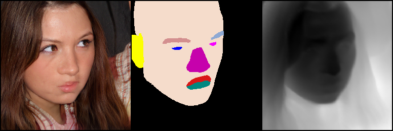

```python
%load_ext autoreload
%autoreload 2
```


```python
import os
import sys
import torch
import numpy as np

# Adding project path
sys.path.append(f'{os.getcwd()}/../')
```


```python
from torchvision import transforms as T
from torchvision.utils import *
from synthforge_train.src.data.synthforge import SynthForgeDataset
from synthforge_train.src.data.utils import seg_classes_to_colors
```


```python
ds = SynthForgeDataset(
    dataset_path='...',
    is_train=False,
    disable_crop_op=True
)
```


```python
plot_colors_next3d = [torch.tensor(x) for x in SynthForgeDataset.SEG_COLORMAP.values()]
```


```python
sample = ds[np.random.randint(len(ds))]
img = sample['img'] * 0.5 + 0.5
seg_map = seg_classes_to_colors(sample["seg_label"].unsqueeze(0), plot_colors_next3d)
depth = sample['depth']
```


```python
T.ToPILImage()(make_grid(torch.stack(
    [img, seg_map, depth.repeat(3, 1, 1)]
)))
```



